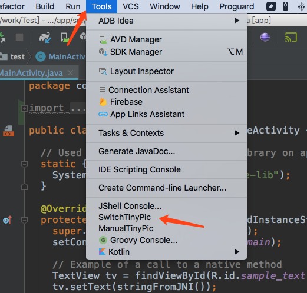
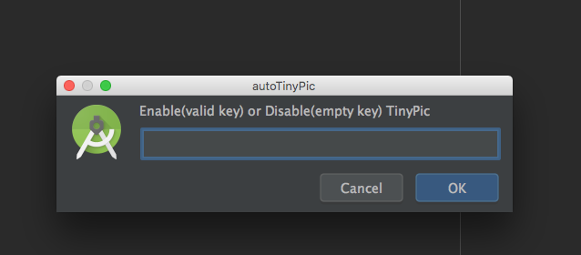

# autoTinyPic
 A plugin for Intellij Idea or Android Studio.
 Automatically add png or jpg images to the project to the [tinypng](https://tinypng.com/) for compression.

# Usages

1. Search and install 'autoTinyPic' in Intellij Idea Plugin Repository.

2. Goto [tinypng](https://tinypng.com/developers) and get your ApiKey.

3.
  
  