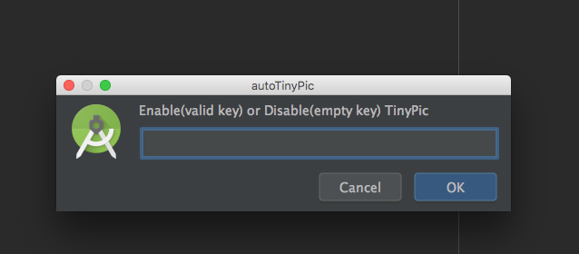

# autoTinyPic
 此插件用于 IntelliJ Idea 或者 Android Studio。

1. 自动对添加进工程的 png 或则 jpg 文件送到 [tinypng](https://tinypng.com/) 网站进行压缩

2. 手动选择文件进行压缩（支持目录且可多选）

3. 对于大于10KB的文件会弹出对话框进行提示，如果选择取消，会自动删除文件

# 使用方法

1. 通过Intellij Idea Plugin Repository搜索 "autoTinyPic" 并进行安装

2. 通过[tinypng](https://tinypng.com/developers)获得你的ApiKey（只需要填用户名和邮箱就行了）

3.
  
  